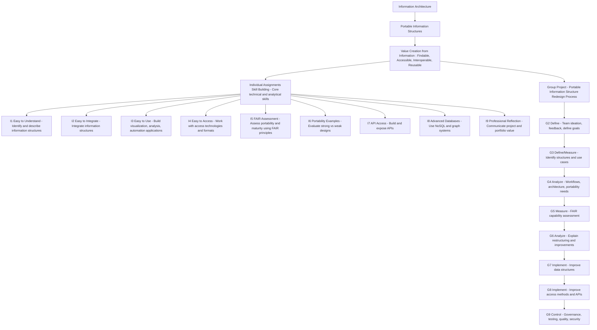

```mermaid
flowchart TB
    A[Information Architecture] --> B[Portable Information Structures]
    B --> C[Value Creation from Information : Findable, Accessible, Interoperable, Reusable]

    C --> D
    C --> E

    D[Individual Assignments Skill Building - Core technical and analytical skills]
    E[Group Project - Portable Information Structure Redesign Process]

    D --> I1[I1 Easy to Understand - Identify and describe information structures]
    D --> I2[I2 Easy to Integrate - Integrate information structures]
    D --> I3[I3 Easy to Use - Build visualization, analysis, automation applications]
    D --> I4[I4 Easy to Access - Work with access technologies and formats]
    D --> I5[I5 FAIR Assessment - Assess portability and maturity using FAIR principles]
    D --> I6[I6 Portability Examples - Evaluate strong vs weak designs]
    D --> I7[I7 API Access - Build and expose APIs]
    D --> I8[I8 Advanced Databases - Use NoSQL and graph systems]
    D --> I9[I9 Professional Reflection - Communicate project and portfolio value]

    E --> G2[G2 Define - Team ideation, feedback, define goals]
    G2 --> G3[G3 Define/Measure - Identify structures and use cases]
    G3 --> G4[G4 Analyze - Workflows, architecture, portability needs]
    G4 --> G5[G5 Measure - FAIR capability assessment]
    G5 --> G6[G6 Analyze - Explain restructuring and improvements]
    G6 --> G7[G7 Implement - Improve data structures]
    G7 --> G8[G8 Implement - Improve access methods and APIs]
    G8 --> G9[G9 Control - Governance, testing, quality, security]
```
