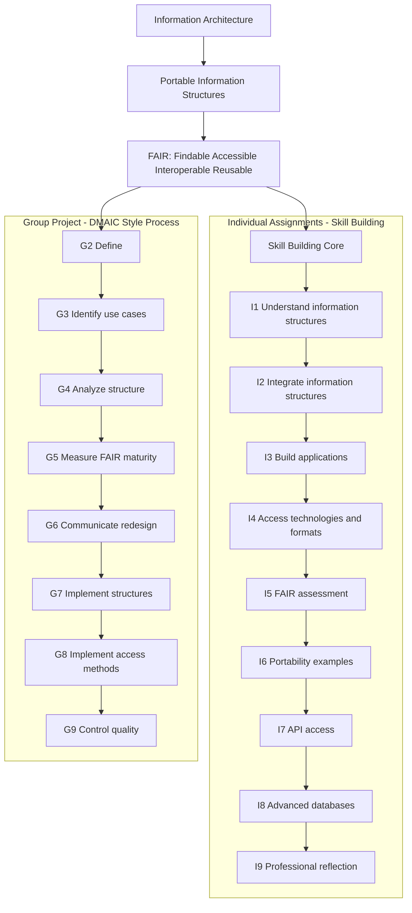

```mermaid

flowchart TB

subgraph INDIVIDUAL["Individual Assignments - Skill Building"]
direction TB

D[Skill Building Core]

I1[I1 Understand information structures]
I2[I2 Integrate information structures]
I3[I3 Build applications]
I4[I4 Access technologies and formats]
I5[I5 FAIR assessment]
I6[I6 Portability examples]
I7[I7 API access]
I8[I8 Advanced databases]
I9[I9 Professional reflection]

D --> I1 --> I2 --> I3 --> I4 --> I5 --> I6 --> I7 --> I8 --> I9

end


subgraph GROUP["Group Project - DMAIC Style Process"]
direction TB

G2[G2 Define]
G3[G3 Identify use cases]
G4[G4 Analyze structure]
G5[G5 Measure FAIR maturity]
G6[G6 Communicate redesign]
G7[G7 Implement structures]
G8[G8 Implement access methods]
G9[G9 Control quality]

G2 --> G3 --> G4 --> G5 --> G6 --> G7 --> G8 --> G9

end


A[Information Architecture]
B[Portable Information Structures]
C[FAIR: Findable Accessible Interoperable Reusable]

A --> B --> C
C --> D
C --> G2

```
