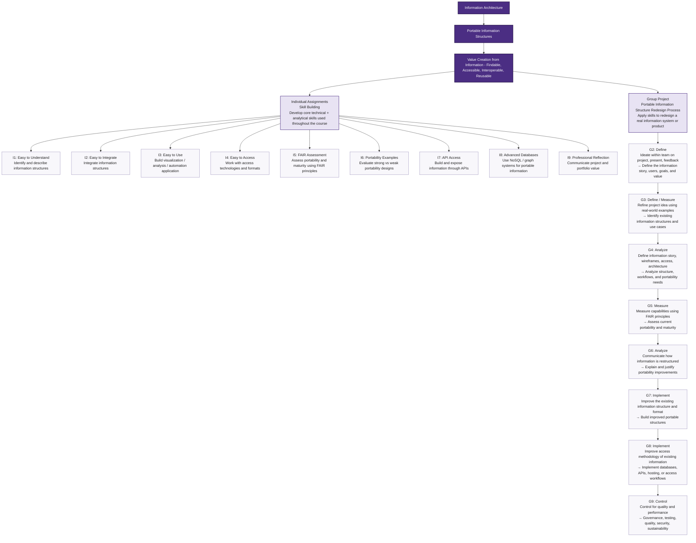

```mermaid
flowchart TB
    A[Information Architecture] --> B[Portable Information Structures]
    B --> C[Value Creation from Information - Findable, Accessible, Interoperable, Reusable]

    C --> D
    C --> E

    D[Individual Assignments<br/> Skill Building <br/>Develop core technical + analytical skills used throughout the course]
    E[Group Project<br/>Portable Information Structure Redesign Process<br/>Apply skills to redesign a real information system or product]

    D --> I1[I1: Easy to Understand<br/>Identify and describe information structures]
    D --> I2[I2: Easy to Integrate<br/>Integrate information structures]
    D --> I3[I3: Easy to Use<br/>Build visualization / analysis / automation application]
    D --> I4[I4: Easy to Access<br/>Work with access technologies and formats]
    D --> I5[I5: FAIR Assessment<br/>Assess portability and maturity using FAIR principles]
    D --> I6[I6: Portability Examples<br/>Evaluate strong vs weak portability designs]
    D --> I7[I7: API Access<br/>Build and expose information through APIs]
    D --> I8[I8: Advanced Databases<br/>Use NoSQL / graph systems for portable information]
    D --> I9[I9: Professional Reflection<br/>Communicate project and portfolio value]

    E --> G2[G2: Define<br/>Ideate within team on project, present, feedback<br/>&rarr; Define the information story, users, goals, and value]
    G2 --> G3[G3: Define / Measure<br/>Refine project idea using real-world examples<br/>&rarr; Identify existing information structures and use cases]
    G3 --> G4[G4: Analyze<br/>Define information story, wireframes, access, architecture<br/>&rarr; Analyze structure, workflows, and portability needs]
    G4 --> G5[G5: Measure<br/>Measure capabilities using FAIR principles<br/>&rarr; Assess current portability and maturity]
    G5 --> G6[G6: Analyze<br/>Communicate how information is restructured<br/>&rarr; Explain and justify portability improvements]
    G6 --> G7[G7: Implement<br/>Improve the existing information structure and format<br/>&rarr; Build improved portable structures]
    G7 --> G8[G8: Implement<br/>Improve access methodology of existing information<br/>&rarr; Implement databases, APIs, hosting, or access workflows]
    G8 --> G9[G9: Control<br/>Control for quality and performance<br/>&rarr; Governance, testing, quality, security, sustainability]

    classDef header fill:#4b2e83,color:#fff,stroke:#2c1a4d,stroke-width:2px;
    classDef section fill:#e8e3f3,color:#1f1f1f,stroke:#4b2e83,stroke-width:1.5px;
    classDef item fill:#f8f7fb,color:#1f1f1f,stroke:#8a7fb0,stroke-width:1px;

    class A,B,C header;
    class D,E section;
    class I1,I2,I3,I4,I5,I6,I7,I8,I9,G2,G3,G4,G5,G6,G7,G8,G9 item;

```
